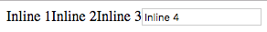

# Example 01 - Inline Element

## Description

In HTML
- inline elements are those which only occupy the space bounded by the tags defining the element
- instead of breaking the flow of the content. [Source: MDN](https://developer.mozilla.org/en-US/docs/Web/HTML/Inline_elements)

## Inline Elements

Here is a list of all inline html elements:

- &lt;a&gt;
- &lt;abbr&gt;
- &lt;acronym&gt;
- &lt;b&gt;
- &lt;bdo&gt;
- &lt;big&gt;
- &lt;br&gt;
- &lt;button&gt;
- &lt;cite&gt;
- &lt;code&gt;
- &lt;dfn&gt;
- &lt;em&gt;
- &lt;i&gt;
- &lt;img&gt;
- &lt;input&gt;
- &lt;kbd&gt;
- &lt;label&gt;
- &lt;map&gt;
- &lt;object&gt;
- &lt;q&gt;
- &lt;samp&gt;
- &lt;script&gt;
- &lt;select&gt;
- &lt;small&gt;
- &lt;span&gt;
- &lt;strong&gt;
- &lt;sub&gt;
- &lt;sup&gt;
- &lt;textarea&gt;
- &lt;time&gt;
- &lt;tt&gt;
- &lt;var&gt;

There are quite a few, but the ones were most interested in are:

- &lt;a&gt;
- &lt;img&gt;
- &lt;input&gt;
- &lt;span&gt;

Span is considered a container for inline tags and can be used to group related tags.

## Examples

### Ex. 1 - Inline
[Full Source](./Ex01-1.html)
```html
<!-- Code Snippet -->
<a>Inline 1</a><a>Inline 2</a><a>Inline 3</a><input value="Inline 4" />
```

*Image Preview*



Notice all the tags display on one line.

### Ex. 2 - Using Spans
[Full Source](./Ex01-2.html)
```html
<!-- Code Snippet -->
<span style="background-color: green; padding: 2px;">
    <a>Inline 1</a><a>Inline 2</a>
</span>
<span style="background-color: red; padding: 2px;">
    <a>Inline 3</a><input value="Inline 4" />
</span>
```

*Image Preview*


Notice the elements are grouped and colored based on the span they are in.

### Ex. 3 - Switching to block
[Full Source](./Ex01-3.html)


