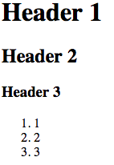
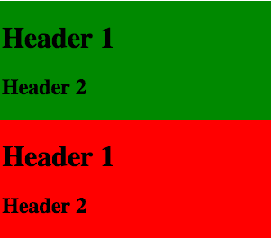
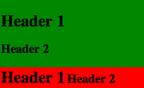

# Example 02 - Block Element

## Description

In HTML
- A block-level element occupies the entire space of its parent element (container), thereby creating a block. [Source: MDN](https://developer.mozilla.org/en-US/docs/Web/HTML/Block-level_elements)

## Block Elements

Here is a list of all block html elements:

- &lt;address&gt;
- &lt;article&gt;
- &lt;aside&gt;
- &lt;blockquote&gt;
- &lt;canvas&gt;
- &lt;dd&gt;
- &lt;div&gt;
- &lt;dl&gt;
- &lt;dt&gt;
- &lt;fieldset&gt;
- &lt;figcaption&gt;
- &lt;figure&gt;
- &lt;figcaption&gt;
- &lt;footer&gt;
- &lt;form&gt;
- &lt;h1&gt;
- &lt;h2&gt;
- &lt;h3&gt;
- &lt;h4&gt;
- &lt;h5&gt;
- &lt;h6&gt;
- &lt;header&gt;
- &lt;hgroup&gt;
- &lt;hr&gt;
- &lt;li&gt;
- &lt;main&gt;
- &lt;nav&gt;
- &lt;noscript&gt;
- &lt;ol&gt;
- &lt;output&gt;
- &lt;p&gt;
- &lt;pre&gt;
- &lt;section&gt;
- &lt;table&gt;
- &lt;tfoot&gt;
- &lt;ul&gt;
- &lt;video&gt;
[Source](https://developer.mozilla.org/en-US/docs/Web/HTML/Inline_elements#Elements)

There are quite a few, but the ones were most interested in are:

- &lt;h1&gt;
- &lt;h2&gt;
- &lt;h3&gt;
- &lt;h4&gt;
- &lt;h5&gt;
- &lt;h6&gt;
- &lt;p&gt;
- &lt;header&gt;
- &lt;ul&gt;
- &lt;ol&gt;
- &lt;li&gt;
- &lt;video&gt;

div is considered a container for other tags and can be used to group related tags.

## Examples

### Ex. 1 - Block
This is a simple example using block tags.

[Full Source](./Ex01-1.html)
```html
<!-- Code Snippet -->
<h1>Header 1</h1>
<h2>Header 2</h2>
<h3>Header 3</h3>
<ol>
    <li>1</li>
    <li>2</li>
    <li>3</li>
</ol>
```

*Image Preview*



Notice all the tags display on different lines.

### Ex. 2 - Using divs
This example uses div to group inline tags.

[Full Source](./Ex01-2.html)
```html
<!-- Code Snippet -->
<div style="background-color: green; padding: 2px;">
    <a>Inline 1</a><a>Inline 2</a>
</div>
<div style="background-color: red; padding: 2px;">
    <a>Inline 3</a><input value=Inline 4 />
</div>
```

*Image Preview*


Notice the elements are grouped and colored based on the div they are in.

### Ex. 3 - Blocks in Blocks
This example uses block level elements inside of divs.

[Full Source](./Ex01-3.html)
```html
<!-- Code Snippet -->
<div style="background-color: green; padding: 2px;">
    <h1>Header 1</h1>
    <h2>Header 2</h2>
</div>
<div style="background-color: red; padding: 2px;">
    <h1>Header 1</h1>
    <h2>Header 2</h2>
</div>
```

*Image Preview*



Notice the elements are grouped and colored based on the div they are in, with each div and header creating a new line.

### Ex. 4 - Switching To Inline
Adding display inline to block elements will move them next to other inline elements.

[Full Source](./Ex01-4.html)

```html
<!-- Code Snippet -->
<div style="background-color: green; padding: 2px;">
    <h1>Header 1</h1>
    <h2>Header 2</h2>
</div>
<div style="background-color: red; padding: 2px;">
    <h1 style="display: inline;">Header 1</h1>
    <h2 style="display: inline;">Header 2</h2>
</div>
```

*Image Preview*



Notice how we've moved the headers on the same line.

### Ex. 5 - Inline Divs
Adding display inline to divs also works and moves them next to other inline elements.

[Full Source](./Ex01-4.html)

```html
<!-- Code Snippet -->
<div style="background-color: green; padding: 2px; display: inline;">
    <h1 style="display: inline;">Header 1</h1>
    <h2 style="display: inline;">Header 2</h2>
</div>
<div style="background-color: red; padding: 2px; display: inline;">
    <h1 style="display: inline;">Header 1</h1>
    <h2 style="display: inline;">Header 2</h2>
</div>
```

*Image Preview*


Notice how every div and header is on the same line.