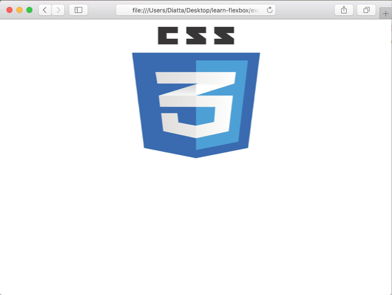
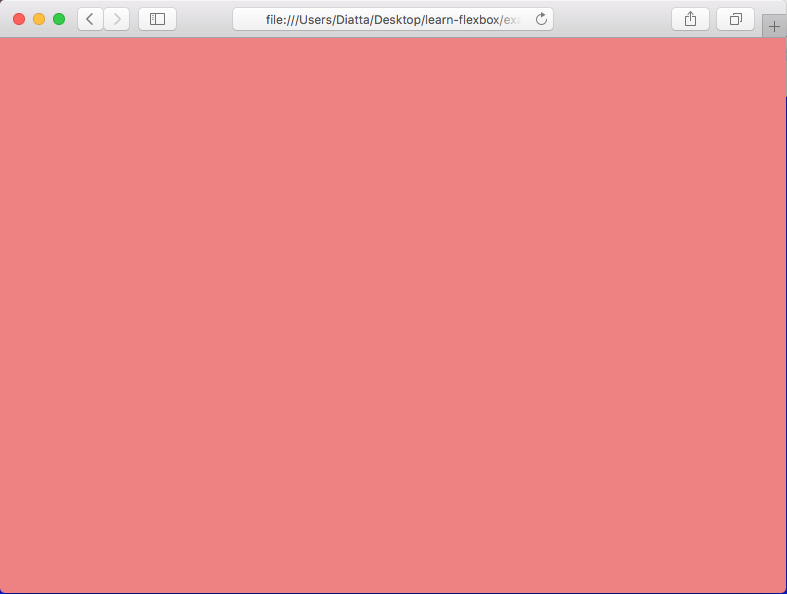
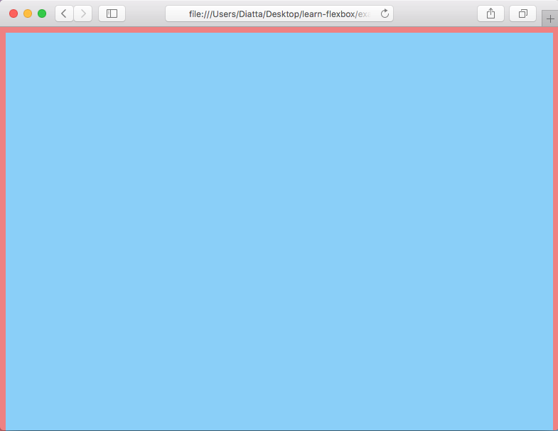
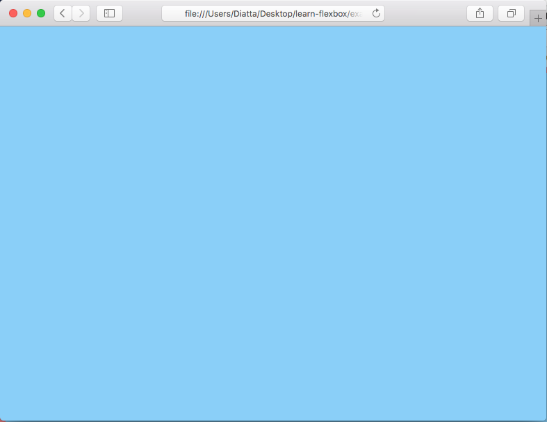
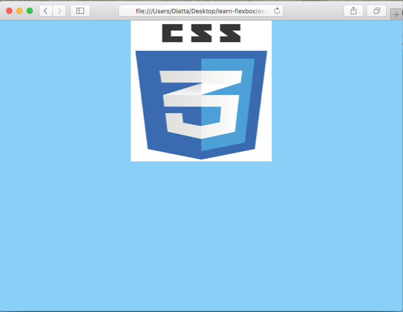
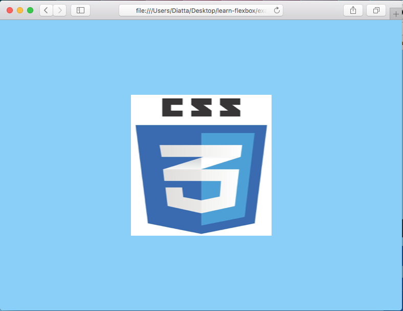
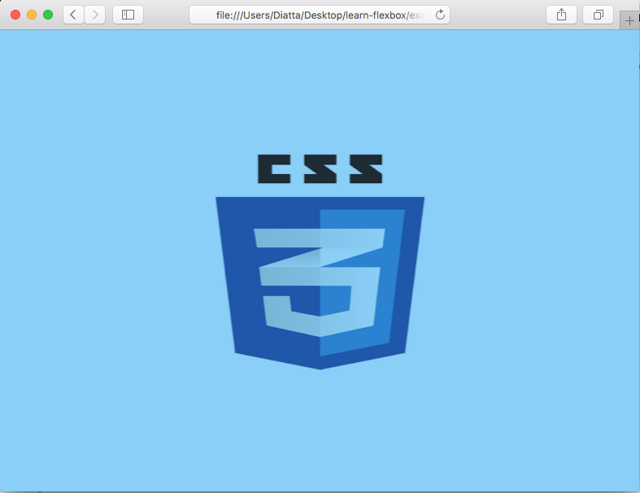

# Example 03 - The Dreaded Center Element

## Description

HTML is not without its quirks, for ages centering an element on the screen was a dread web developer task.
With flexbox centering elements is a breeze, although you'll still have to fight the browsers default styling.

## Examples

### Ex. 1 - Fail
Setting you up for failure

[Full Source](./Ex03-1.html)
```html
<!-- Code Snippet -->
<div style="display: flex; align-items: center; justify-content: center;">
    
</div>
```

*Image Preview*



Notice the logo is not centered in the page.

### Ex. 2 - What the Height?
First inclincation is to think we've messed up our styles, but this is a problem of omission. Here's a series of examples that will stress your html intution.

#### Sub Ex-a

[Source](./Ex03-2a.html)
```html
<!DOCTYPE html>
<html lang="en" style="background-color: lightcoral">
<head>
    <meta charset="UTF-8">
    <title>Example 03-2a Centering</title>
</head>
<body>

</body>
</html>
```

*Image Preview*



We've set the html tags style background to lightcoral, the result is a pink page. Lets try to style the body tag now.

#### Sub Ex-b

[Source](./Ex03-2b.html)
```html
<!DOCTYPE html>
<html lang="en" style="background-color: lightcoral">
<head>
    <meta charset="UTF-8">
    <title>Example 03-2b Inline</title>
</head>
<body style="background-color: lightskyblue;">

</body>
</html>
```

*Image Preview*


Notice our page is still pink, what's going on? The body has no height.

#### Sub Ex-c

[Source](./Ex03-2c.html)
```html
<!DOCTYPE html>
<html lang="en" style="background-color: lightcoral">
<head>
    <meta charset="UTF-8">
    <title>Example 03-2c Centering</title>
</head>
<body style="background-color: lightskyblue; height: 100%;">

</body>
</html>
```

*Image Preview*


We've added a `height: 100%` to our body tag but we still don't see any blue. We're missing a height on the html element.

#### Sub Ex-d

[Source](./Ex03-2d.html)
```html
<!DOCTYPE html>
<html lang="en" style="background-color: lightcoral; height: 100%">
<head>
    <meta charset="UTF-8">
    <title>Example 03-2d Centering</title>
</head>
<body style="background-color: lightskyblue; height: 100%;">

</body>
</html>
```

*Image Preview*



You should now have a mostly blue screen with a border of pink around it, but depending on your browser styles it may not appear.

#### Sub Ex-e

[Source](./Ex03-2e.html)
```html
<!DOCTYPE html>
<html lang="en" style="background-color: lightcoral; height: 100%">
<head>
    <meta charset="UTF-8">
    <title>Example 03-2e Centering</title>
</head>
<body style="background-color: lightskyblue;
            height: 100%;
            margin: 0;">

</body>
</html>
```

*Image Preview*



Now your screen should be completely blue unless there are other default styles applied.

### Ex. 3 - Fail Pt.2
Lets combine the first and last example.

[Full Source](./Ex03-3.html)
```html
<!DOCTYPE html>
<html lang="en" style="background-color: lightcoral; height: 100%">
<head>
    <meta charset="UTF-8">
    <title>Example 03-3 Centering</title>
</head>
<body style="background-color: lightskyblue;
            height: 100%;
            margin: 0;">
    <div style="display: flex;
                align-items: center;
                justify-content: center;">
        
    </div>

</body>
</html>
```

*Image Preview*



Notice the logo is still not centered in the page. The fix is simple, add height to the containing div!

### Ex. 4 - Succeed
We'll fix the div height so the element will finally center.

[Full Source](./Ex03-4.html)
```html
<!DOCTYPE html>
<html lang="en" style="background-color: lightcoral; height: 100%">
<head>
    <meta charset="UTF-8">
    <title>Example 03-4 Centering</title>
</head>
<body style="background-color: lightskyblue;
            height: 100%;
            margin: 0;">
    <div style="display: flex;
                align-items: center;
                justify-content: center;
                height: 100%;">
        
    </div>

</body>
</html>
```

*Image Preview*



Finally the logo is centered.

### Ex. 5 - Cleaning up
Lets clean up the example before finishing up. We'll multiply the image into the background and rmeove the none visible background color from the html tag.

[Full Source](./Ex03-5.html)
```html
<!DOCTYPE html>
<html lang="en" style="height: 100%">
<head>
    <meta charset="UTF-8">
    <title>Example 03-5 Centering</title>
</head>
<body style="background-color: lightskyblue;
            height: 100%;
            margin: 0;">
    <div style="display: flex;
                align-items: center;
                justify-content: center;
                height: 100%;">
        
    </div>
</body>
</html>
```

*Image Preview*



Clean and simple.
