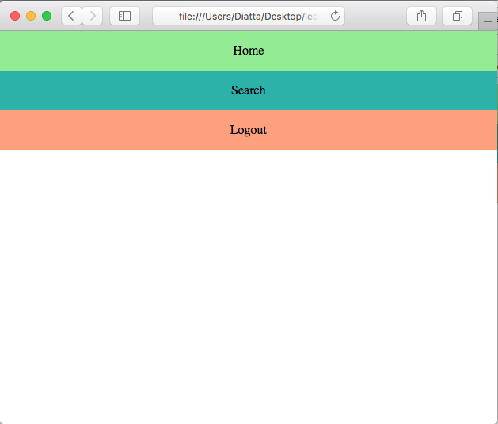
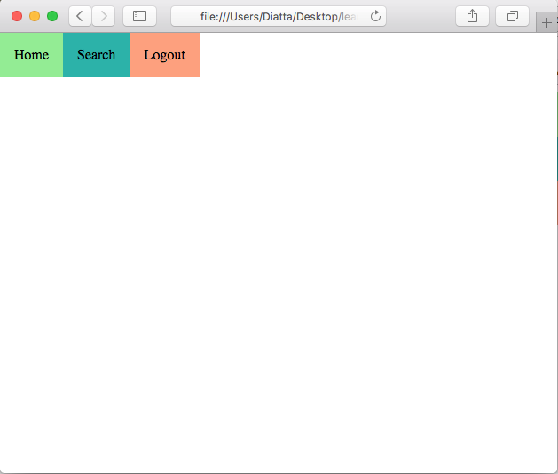
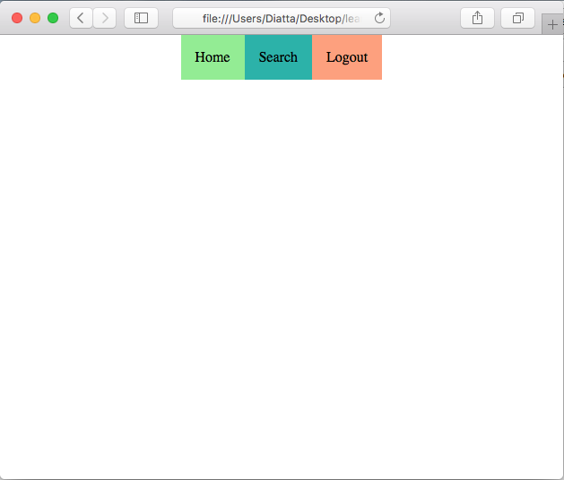
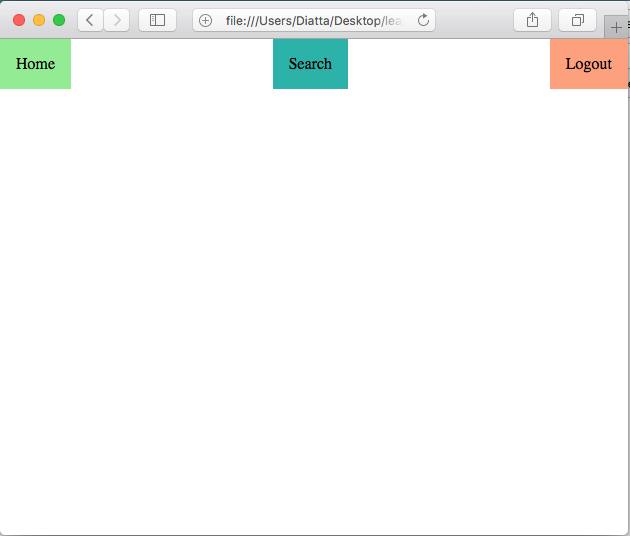
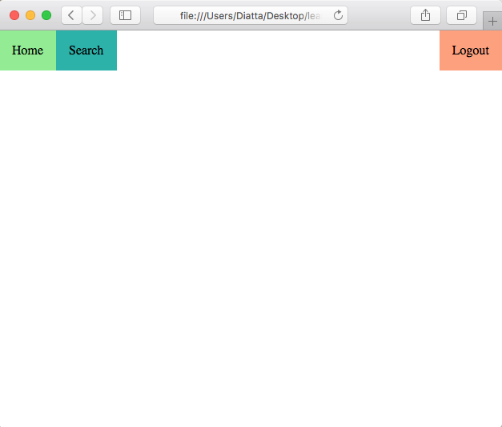
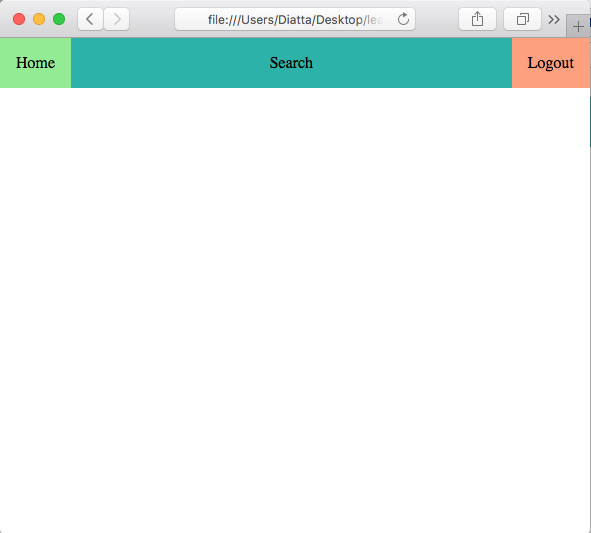

# Example 04 - Basic Nav

## Description

In this example we'll use flexbox to create a basic navigation bar.

## Examples

### Ex. 1 - No Flex
Lets create a basic block level nav bar.

[Full Source](./Ex04-1.html)
```html
<!-- Code Snippet -->
<nav>
    <div class="navItem" style="background-color: lightgreen;">Home</div>
    <div class="navItem" style="background-color: lightseagreen">Search</div>
    <div class="navItem" style="background-color: lightsalmon">Logout</div>
</nav>
```

*Image Preview*



Each nav item is on its own row, taking up the entire width of the browser.

### Ex. 2 - Adding Flex
Lets see what happens when we add flex to the nav element.

[Full Source](./Ex04-2.html)
```html
<!-- Code Snippet -->
<nav style="display: flex;">
    <div class="navItem" style="background-color: lightgreen;">Home</div>
    <div class="navItem" style="background-color: lightseagreen">Search</div>
    <div class="navItem" style="background-color: lightsalmon">Logout</div>
</nav>
```

*Image Preview*



Now all the nav items are on the same line as if they were displayed inline, however we can do very different things to them compared to real inline-block element.

### Ex. 3 - Center The Items
Lets center the items on the navbar. We can use the `justify-content` property to move items within a flex container.

[Full Source](./Ex04-3.html)
```html
<!-- Code Snippet -->
<nav style="display: flex; justify-content: center;">
    <div class="navItem" style="background-color: lightgreen;">Home</div>
    <div class="navItem" style="background-color: lightseagreen">Search</div>
    <div class="navItem" style="background-color: lightsalmon">Logout</div>
</nav>
```

*Image Preview*



Now all the nav items are centered in the middle of the container. The `justify-content` property is used to items along the main axis.

### Ex. 4 - Space Between
We can orient the elements with space between them using the `space-between` property.

[Full Source](./Ex04-4.html)
```html
<!-- Code Snippet -->
<nav style="display: flex; justify-content: space-between;">
    <div class="navItem" style="background-color: lightgreen;">Home</div>
    <div class="navItem" style="background-color: lightseagreen">Search</div>
    <div class="navItem" style="background-color: lightsalmon">Logout</div>
</nav>
```

*Image Preview*



Now you can see the elements are spread across the screen, with one block on the left, one on the right, and one in the middle.

### Ex. 5 - Moving One
We can use other css position properties to adjust an elements positioning within the flexbox.

[Full Source](./Ex04-5.html)
```html
<!-- Code Snippet -->
<nav style="display: flex; justify-content: space-between;">
    <div class="navItem" style="background-color: lightgreen;">Home</div>
    <div class="navItem" style="background-color: lightseagreen;
                                margin-right: auto;">Search</div>
    <div class="navItem" style="background-color: lightsalmon">Logout</div>
</nav>
```

*Image Preview*



Now you can see the elements are spread across the screen, with one block on the left, one on the right, and one in the middle.

### Ex. 6 - Make Them Grow
Flex elements widths can respond to page size changes using the flex grow property.

[Full Source](./Ex04-6.html)
```html
<!-- Code Snippet -->
<nav style="display: flex; justify-content: space-between;">
    <div class="navItem" style="background-color: lightgreen;">Home</div>
    <div class="navItem" style="background-color: lightseagreen;
                                margin-right: auto;
                                flex-grow: 1">Search</div>
    <div class="navItem" style="background-color: lightsalmon">Logout</div>
</nav>
```

*Image Preview*



Now the ceneter element is stretched and fills up the space between the two outer elements.

## Attribution

Based on thee article by Per Harald Borgen on [medium](https://medium.freecodecamp.org/learn-css-flexbox-in-5-minutes-b941f0affc34).
