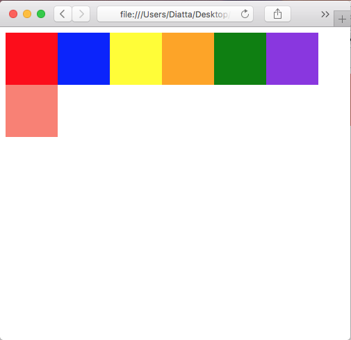
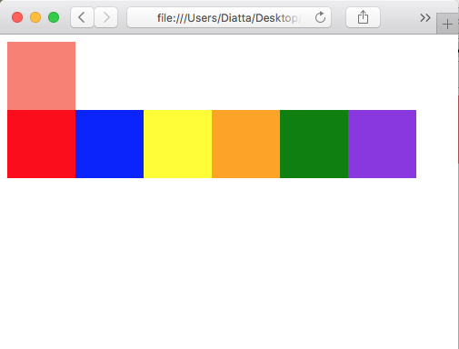
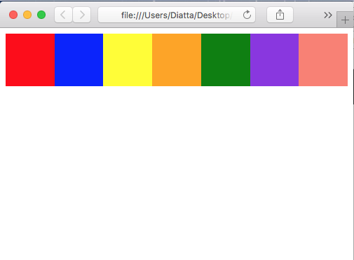
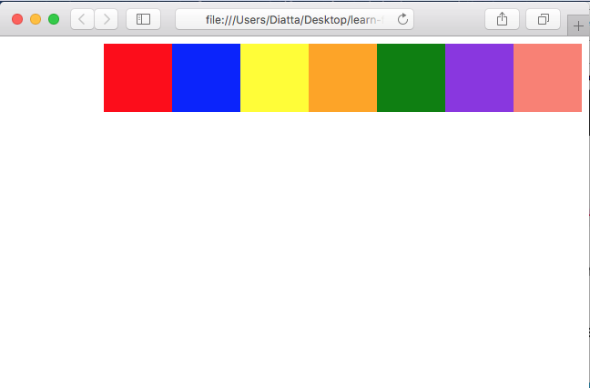
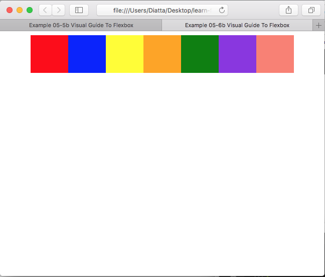
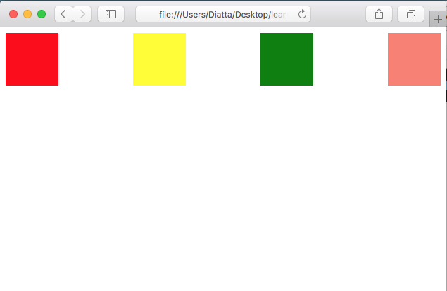
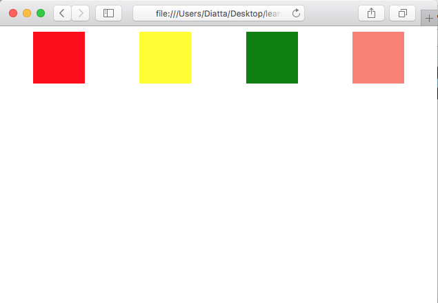
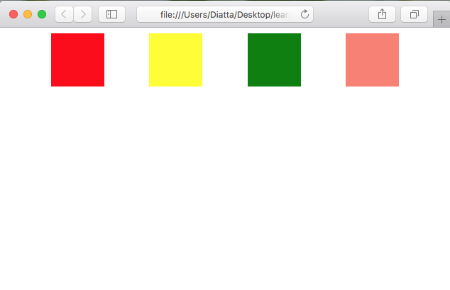

# Example 05 - Visual Guide To Flexbox

## Description

In this example we're going to visualize all of flexbox's properties.

## Basics

*Copied Direclty From: [Visual Guide To Flexbox on Scotch.io](https://scotch.io/tutorials/a-visual-guide-to-css3-flexbox-properties)*

>Before we start with describing the flexbox properties let’s give a little introduction of the flexbox model. The flex layout is constituted of parent container referred as flex container and its immediate children which are called flex items.

*Flex Model*


>In the box above you can see the properties and the terminology used to describe the flex container and its children. For more information on their meaning read the official [flexbox model](https://www.w3.org/TR/css-flexbox/#box-model) by W3C.

## Examples

### Ex. 1 - Lets make some boxes
We're going to create some boxes in a container without changing to flex.

[Full Source](./Ex05-1.html)
```html
<!-- Code Snippet -->
<div>
    <div class="box red"></div>
    <div class="box blue"></div>
    <div class="box yellow"></div>
    <div class="box orange"></div>
    <div class="box green"></div>
    <div class="box blue-violet"></div>
    <div class="box salmon"></div>
</div>
```

*Image Preview*


Each box is on its own row, stacking on top of each other.

### Ex. 2 - Lets make some boxes
Lets turn our container into a flex container.

[Full Source](./Ex05-2.html)
```html
<!-- Code Snippet -->
<div style="display: flex">
    <div class="box red"></div>
    <div class="box blue"></div>
    <div class="box yellow"></div>
    <div class="box orange"></div>
    <div class="box green"></div>
    <div class="box blue-violet"></div>
    <div class="box salmon"></div>
</div>
```

*Image Preview*


All we did was add display flex on the container div. Now all of our boxes are on the same line.

### Ex. 3 - Back to column
If we want our flex items stacked on top of each other like in block mode, we can use flex-direction

[Full Source](./Ex05-3.html)
```html
<!-- Code Snippet -->
<div style="display: flex; flex-direction: column;">
    <div class="box red"></div>
    <div class="box blue"></div>
    <div class="box yellow"></div>
    <div class="box orange"></div>
    <div class="box green"></div>
    <div class="box blue-violet"></div>
    <div class="box salmon"></div>
</div>
```

*Image Preview*


After adding flex-direction column to the container, the boxes are oriented like they were in block mode.

### Ex. 4 - Reverse
We can use reversed versions of each direction to flip the orientation around.

#### row-reverse

[Full Source](./Ex05-4a.html)
```html
<!-- Code Snippet -->
<div style="display: flex; flex-direction: row-reverse;">
    <div class="box red"></div>
    <div class="box blue"></div>
    <div class="box yellow"></div>
    <div class="box orange"></div>
    <div class="box green"></div>
    <div class="box blue-violet"></div>
    <div class="box salmon"></div>
</div>
```

*Image Preview*


When we change flex-direction to row-reverse, we see our boxes are oriented in a row in reverse order.

#### column-reverse

[Full Source](./Ex05-4b.html)
```html
<!-- Code Snippet -->
<div style="display: flex; flex-direction: column-reverse;">
    <div class="box red"></div>
    <div class="box blue"></div>
    <div class="box yellow"></div>
    <div class="box orange"></div>
    <div class="box green"></div>
    <div class="box blue-violet"></div>
    <div class="box salmon"></div>
</div>
```

*Image Preview*


When we change flex-direction to column-reverse, we see our boxes are oriented in a column in reverse order.

### Ex. 5 - Flex Wrap
If we want the elements in our flex box to break onto new lines when the page size shrinks we can use flex-wrap.

#### wrap

[Full Source](./Ex05-5a.html)
```html
<!-- Code Snippet -->
<div style="display: flex; flex-wrap: wrap;">
    <div class="box red"></div>
    <div class="box blue"></div>
    <div class="box yellow"></div>
    <div class="box orange"></div>
    <div class="box green"></div>
    <div class="box blue-violet"></div>
    <div class="box salmon"></div>
</div>
```

*Image Preview*



With flex-wrap enabled, our end box falls to a new line when it can no longer fit on its original row.

#### wrap-reverse

[Full Source](./Ex05-5b.html)
```html
<!-- Code Snippet -->
    <div style="display: flex; flex-wrap: wrap-reverse;">
        <div class="box red"></div>
        <div class="box blue"></div>
        <div class="box yellow"></div>
        <div class="box orange"></div>
        <div class="box green"></div>
        <div class="box blue-violet"></div>
        <div class="box salmon"></div>
    </div>
```

*Image Preview*



With by using wrap-reverse, all items that would have fit on the row are moved to a new row, while the items that should have fallen off take up the initial positions.

### Ex. 6 - Justify Content
The justify-content property allows us to distribute flex items along the main axis. The main axis for row is left to right, the main axis for column is top to bottom, the main axis for row-reverse is right to left, and the main axis for column-reverse is bottom to top.

#### flex-start

[Full Source](./Ex05-6a.html)
```html
<!-- Code Snippet -->
<div style="display: flex; justify-content: flex-start;">
    <div class="box red"></div>
    <div class="box blue"></div>
    <div class="box yellow"></div>
    <div class="box orange"></div>
    <div class="box green"></div>
    <div class="box blue-violet"></div>
    <div class="box salmon"></div>
</div>
```

*Image Preview*



As you can see, there's no change, this is because flex-start is the default option for justify-content.

#### flex-end

[Full Source](./Ex05-6b.html)
```html
<!-- Code Snippet -->
<div style="display: flex; justify-content: flex-end;">
    <div class="box red"></div>
    <div class="box blue"></div>
    <div class="box yellow"></div>
    <div class="box orange"></div>
    <div class="box green"></div>
    <div class="box blue-violet"></div>
    <div class="box salmon"></div>
</div>
```

*Image Preview*



When the page is made a little larger you can see that the boxes push to the end of the row and stay fixed. This is the effect of flex-end, to place items at the end of the main axis.

#### center

[Full Source](./Ex05-6c.html)
```html
<!-- Code Snippet -->
<div style="display: flex; justify-content: center;">
    <div class="box red"></div>
    <div class="box blue"></div>
    <div class="box yellow"></div>
    <div class="box orange"></div>
    <div class="box green"></div>
    <div class="box blue-violet"></div>
    <div class="box salmon"></div>
</div>
```

*Image Preview*



Now our flex items are centered in the middle of the screen between theb beginning and end point of the main axis.

#### space-between

[Full Source](./Ex05-6d.html)
```html
<!-- Code Snippet -->
<div style="display: flex; justify-content: space-between;">
    <div class="box red"></div>
    <div class="box yellow"></div>
    <div class="box green"></div>
    <div class="box salmon"></div>
</div>
```

*Image Preview*



Now our flex items are spread across the main axis. The first and last items are at the beginning and end of the main axis with space between every other item.

#### space-around

[Full Source](./Ex05-6e.html)
```html
<!-- Code Snippet -->
<div style="display: flex; justify-content: space-around;">
    <div class="box red"></div>
    <div class="box yellow"></div>
    <div class="box green"></div>
    <div class="box salmon"></div>
</div>
```

*Image Preview*



Now the beginning and end items have space in front and after them. This is the main difference between space-around and space-between.

#### space-evenly

[Full Source](./Ex05-6f.html)
```html
<!-- Code Snippet -->
<div style="display: flex; justify-content: space-evenly;">
    <div class="box red"></div>
    <div class="box yellow"></div>
    <div class="box green"></div>
    <div class="box salmon"></div>
</div>
```

*Image Preview*



Now our flex items are spread evenly across the main axis. The space-evenly option looks very similar to space-around. The difference is space-evenly has equal space around every item while space-around has half-size space on either end.

## Attribution

Based on the article by Per Dimitar Stojanov on [scotch.io](https://scotch.io/tutorials/a-visual-guide-to-css3-flexbox-properties).
