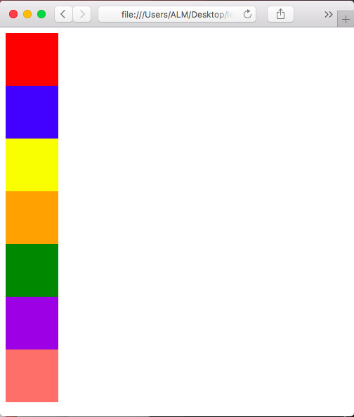
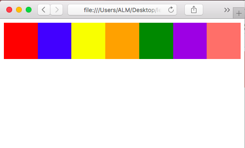
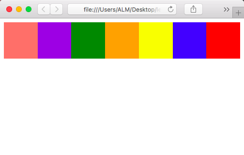
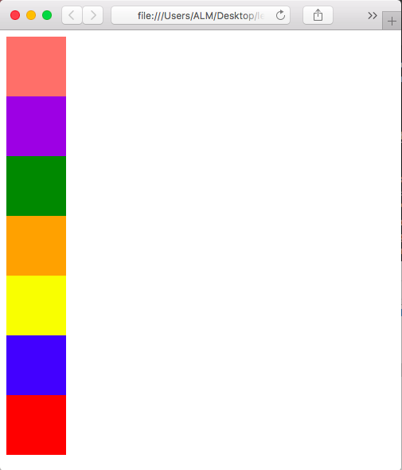

# Example 05 - Visual Guide To Flexbox

## Description

In this example we're going to visualize all of flexbox's properties.

## Basics

*Copied Direclty From: [Visual Guide To Flexbox on Scotch.io](https://scotch.io/tutorials/a-visual-guide-to-css3-flexbox-properties)*

>Before we start with describing the flexbox properties let’s give a little introduction of the flexbox model. The flex layout is constituted of parent container referred as flex container and its immediate children which are called flex items.

*Flex Model*


>In the box above you can see the properties and the terminology used to describe the flex container and its children. For more information on their meaning read the official [flexbox model](https://www.w3.org/TR/css-flexbox/#box-model) by W3C.

## Examples

### Ex. 1 - Lets make some boxes
We're going to create some boxes in a container without changing to flex.

[Full Source](./Ex05-1.html)
```html
<!-- Code Snippet -->
<div>
    <div class="box red"></div>
    <div class="box blue"></div>
    <div class="box yellow"></div>
    <div class="box orange"></div>
    <div class="box green"></div>
    <div class="box blue-violet"></div>
    <div class="box salmon"></div>
</div>
```

*Image Preview*



Each box is on its own row, stacking on top of each other.

### Ex. 2 - Lets make some boxes
Lets turn our container into a flex container.

[Full Source](./Ex05-2.html)
```html
<!-- Code Snippet -->
<div style="display: flex">
    <div class="box red"></div>
    <div class="box blue"></div>
    <div class="box yellow"></div>
    <div class="box orange"></div>
    <div class="box green"></div>
    <div class="box blue-violet"></div>
    <div class="box salmon"></div>
</div>
```

*Image Preview*



All we did was add display flex on the container div. Now all of our boxes are on the same line.

### Ex. 3 - Back to column
If we want our flex items stacked on top of each other like in block mode, we can use flex-direction

[Full Source](./Ex05-3.html)
```html
<!-- Code Snippet -->
<div style="display: flex; flex-direction: column;">
    <div class="box red"></div>
    <div class="box blue"></div>
    <div class="box yellow"></div>
    <div class="box orange"></div>
    <div class="box green"></div>
    <div class="box blue-violet"></div>
    <div class="box salmon"></div>
</div>
```

*Image Preview*


After adding flex-direction column to the container, the boxes are oriented like they were in block mode.

### Ex. 4 - Reverse
We can use reversed versions of each direction to flip the orientation around.

#### row-reverse

[Full Source](./Ex05-4a.html)
```html
<!-- Code Snippet -->
<div style="display: flex; flex-direction: row-reverse;">
    <div class="box red"></div>
    <div class="box blue"></div>
    <div class="box yellow"></div>
    <div class="box orange"></div>
    <div class="box green"></div>
    <div class="box blue-violet"></div>
    <div class="box salmon"></div>
</div>
```

*Image Preview*



When we change flex-direction to row-reverse, we see our boxes are oriented in a row in reverse order.

#### column-reverse

[Full Source](./Ex05-4b.html)
```html
<!-- Code Snippet -->
<div style="display: flex; flex-direction: column-reverse;">
    <div class="box red"></div>
    <div class="box blue"></div>
    <div class="box yellow"></div>
    <div class="box orange"></div>
    <div class="box green"></div>
    <div class="box blue-violet"></div>
    <div class="box salmon"></div>
</div>
```

*Image Preview*



When we change flex-direction to column-reverse, we see our boxes are oriented in a column in reverse order.

## Attribution

Based on the article by Per Dimitar Stojanov on [scotch.io](https://scotch.io/tutorials/a-visual-guide-to-css3-flexbox-properties).
