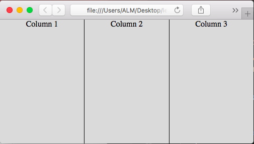

# Quickie 1 - Three Column Design

## Description

Three column layout designs were very difficult to accomplish for many years, involving all sorts of hacks. Thankfully 

## Examples

### Ex. 1 - Inline
This is a simple example using inline tags.

[Source](./Qk01.html)
```html
<!DOCTYPE html>
<html lang="en" class="h100">
<head>
    <meta charset="UTF-8">
    <title>Quickie 1 - Three Column Layout</title>
    <style>
        .h100 {
            height: 100%;
        }

        .br {
            border-right: 1px solid black;
        }

        .container {
            display: flex;
            align-items: stretch;
            background-color: #dadada;
        }
        
        .column {
            width: 100%;
            text-align: center;
            /* height: 100%; */
        }
    </style>
</head>
<body class="h100" style="margin: 0;">
    <div class="container h100">
        <div class="column br">Column 1</div>
        <div class="column br">Column 2</div>
        <div class="column">Column 3</div>
    </div>
</body>
</html>
```

*Image Preview*



Notice we've broken the page into three columns. Each column can have its own set of elements. This is accomplished by setting display to flex and align-items to stretch on the containing div. It's important to keep in mind that it's recommended to use CSS grid for this kind of page layout.
